<div align="center">

  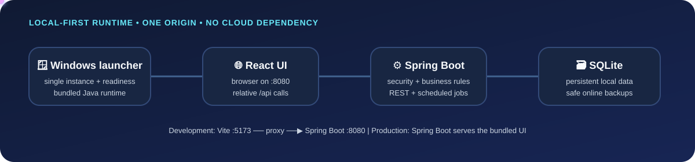

  <h1>🎮 Gaming Cafe Management System</h1>

  <p><strong>A local-first operations platform for PlayStation gaming cafes.</strong></p>
  <p>Run devices, sessions, reservations, café sales, inventory, billing, shifts, reports, and access control from one browser-based workspace.</p>

  <p>
    
    
    
    
    
    
  </p>

  <p>
    <a href="#-business-overview">Business</a> ·
    <a href="#-workflows">Workflows</a> ·
    <a href="#-architecture">Architecture</a> ·
    <a href="#️-technology-stack">Technology</a> ·
    <a href="#-development">Development</a> ·
    <a href="#-production-packaging">Packaging</a>
  </p>

</div>

> [!NOTE]
> The animated header is a repository-local SVG. It has no external image dependency and falls back to a static architecture graphic in Markdown renderers that do not run SVG animations.

> [!IMPORTANT]
> The installed client is designed to run without Node.js, npm, Maven, IntelliJ, source code, or a globally installed Java runtime. Those tools are required only on a development/build machine.

## 🧭 Contents

- [🎯 Business overview](#-business-overview)
- [🔁 Workflows](#-workflows)
- [🧱 Architecture](#-architecture)
- [🛠️ Technology stack](#️-technology-stack)
- [🗺️ Feature map](#️-feature-map)
- [🗃️ Data model and persistence](#️-data-model-and-persistence)
- [🔐 Security and permissions](#-security-and-permissions)
- [📁 Repository map](#-repository-map)
- [💻 Development](#-development)
- [📦 Production packaging](#-production-packaging)
- [🪟 Client experience](#-client-experience)
- [💾 Operations, backups, and upgrades](#-operations-backups-and-upgrades)
- [✅ Testing and verification](#-testing-and-verification)
- [⚠️ Known limitations](#️-known-limitations)

## 🎯 Business overview

Gaming Cafe is an offline-capable, local-network system for a shop that rents PlayStation devices and sells café products. It keeps the operational loop in one place:

```text
🎮 Device availability → ⏱️ Gaming session → ☕ Café order → 💳 Checkout → 🧾 Shift/reporting
```

### The people and their jobs

| Role | Primary responsibility | Typical actions |
| --- | --- | --- |
| 🧑‍💼 **Admin** | Owns the system and access model | Manage users, roles, permissions, settings, devices, catalog, pricing, inventory, billing, and reports |
| 📋 **Manager** | Runs the shop and supervises staff | Monitor operations, manage catalog/pricing/inventory, review reports, audit shifts, manage discounts and billing administration |
| 🧾 **Cashier** | Serves customers at the counter | Start and monitor sessions, handle reservations, create POS orders, take payments, manage personal shifts, and view permitted catalog/inventory data |
| 👤 **Customer** | Consumes the service | Book a device, play a session, buy products, and settle the bill through staff |

### The business problems it solves

- 🎮 **Device operations** — know which PS4/PS5 stations are available, playing, reserved, under maintenance, or offline.
- ⏱️ **Flexible session billing** — support `SINGLE`, `MULTI`, and `MATCH` sessions, hourly or per-match pricing, planned duration, open-time sessions, match completion, extensions, live timers, and live cost.
- 📅 **Reservations** — record customers, reserve a device, check a booking in, cancel it, and automatically mark stale bookings as no-shows.
- ☕ **Point of sale** — create standalone orders or attach café orders to a gaming session; add products, change quantities, apply approved discounts, hold/resume, cancel, and complete orders.
- 📦 **Inventory control** — track purchases, adjustments, waste, sales, refunds, stock levels, minimum stock, categories, and movement history.
- 💳 **Financial control** — prepare and settle gaming bills, record cash/card/mobile-wallet payments, cancel pending bills, and restrict refunds.
- 🧮 **Cashier accountability** — open and close shifts, calculate expected totals, reconcile transactions, and expose manager/admin audit reports.
- 📊 **Management visibility** — view today’s operational summary, revenue, sessions, products, cashier activity, and date-based reports.
- 🔐 **Controlled access** — use role and permission data in both the UI and secured backend endpoints.

## 🔁 Workflows

### A. The complete customer journey

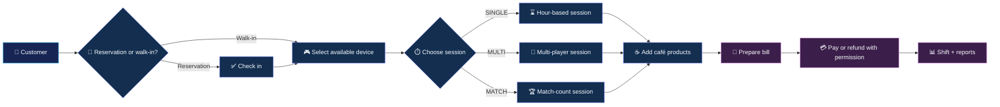

### B. Reservation → session

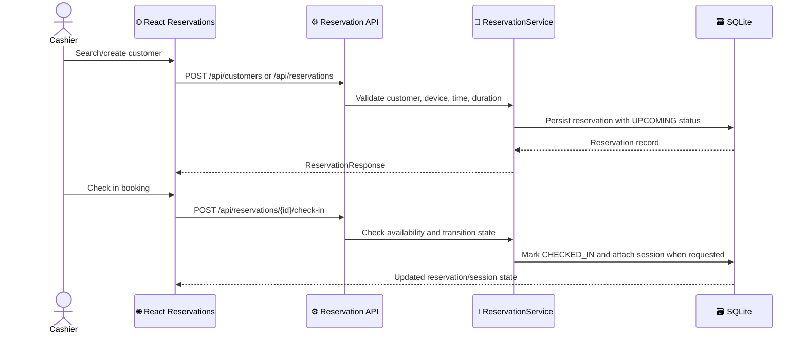

### C. Live session → checkout

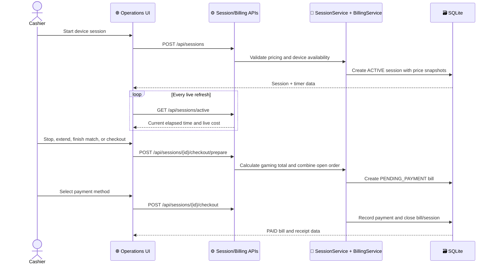

### D. POS → stock movement

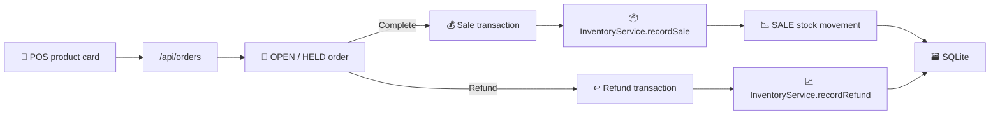

### E. Shift close → accountability

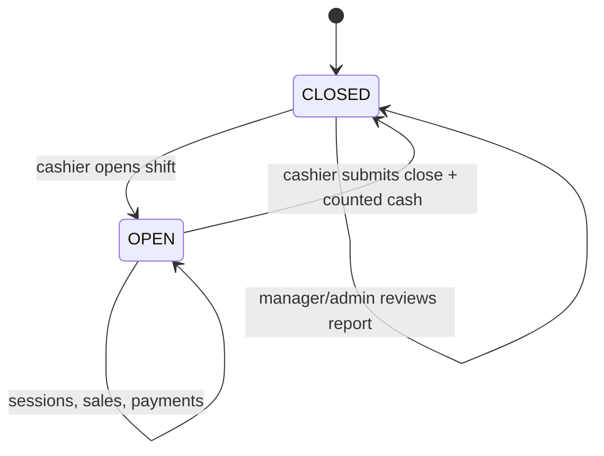

## 🧱 Architecture

### Production topology

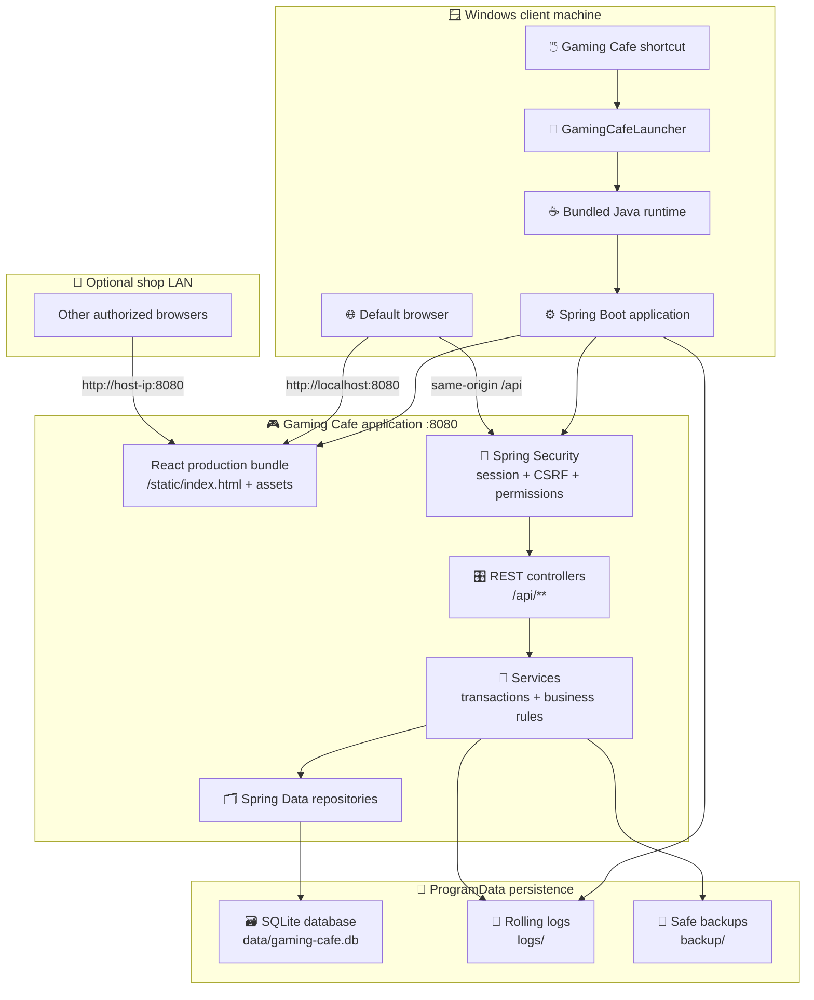

### Development topology

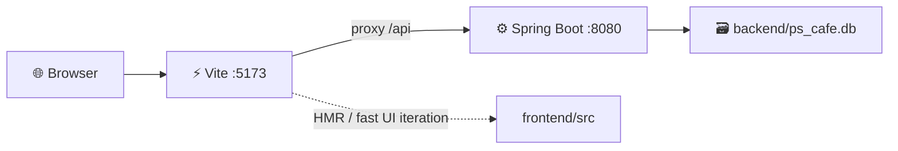

Production has one origin: `http://localhost:8080`. Development keeps Vite for hot reload, while the Vite proxy forwards the same relative `/api/...` calls to Spring Boot.

### One request from screen to database

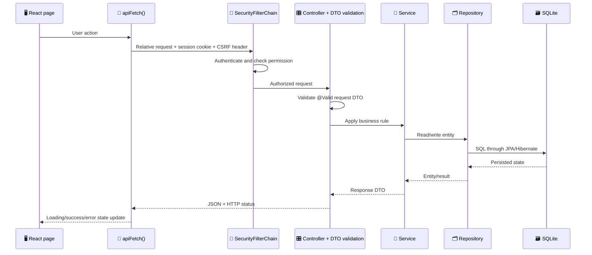

### Architectural boundaries

| Boundary | Responsibility | Implementation |
| --- | --- | --- |
| 🎨 Presentation | Navigation, forms, timers, empty/loading/error states | React pages and shared components under `frontend/src/components` |
| 📡 API client | Relative URLs, CSRF bootstrap, JSON/error handling | `frontend/src/api/http.js` and domain API modules |
| 🔐 Web security | Session authentication, CSRF, CORS, endpoint authorization | `SecurityConfig`, `AuthController`, `@PreAuthorize` annotations |
| 🎛️ HTTP boundary | Request validation and response mapping | Controllers and DTO records under `backend/src/main/java/com/cafe/ps` |
| 🧠 Domain/application | Pricing, session state, inventory, checkout, reports, shifts | Services under `backend/src/main/java/com/cafe/ps/service` |
| 🗂️ Persistence | Entity mapping and query access | JPA entities and Spring Data repositories |
| 💾 Runtime | SQLite paths, migrations, logs, backups, launcher lifecycle | `RuntimePaths`, Flyway, `DatabaseBackupService`, `GamingCafeLauncher` |

## 🛠️ Technology stack

| Layer | Technology | Why it is used |
| --- | --- | --- |
| ☕ Language/runtime | Java 17 target, JDK 17+ build requirement | Stable JVM baseline and bundled runtime compatibility |
| ⚙️ Backend | Spring Boot `3.3.2` | Application bootstrap, embedded Tomcat, configuration, lifecycle |
| 🌐 Web/API | Spring Web MVC | REST endpoints and JSON responses |
| 🧩 Persistence | Spring Data JPA + Hibernate ORM | Entity mapping, repositories, transactions, database portability |
| 🗃️ Database | SQLite via Xerial `3.46.1.3` | Local-first, low-operations storage for a shop workstation |
| 🛫 Schema | Flyway | SQLite baseline and compatibility migration; production schema authority |
| 🔐 Security | Spring Security | Session login, BCrypt password hashes, CSRF, method-level permissions |
| ✅ Validation | Hibernate Validator / Spring Boot validation | DTO constraints and consistent bad-request handling |
| 📈 Operations | Spring Boot Actuator | Public health/status checks used by launcher and operations |
| 📝 Logging | Logback + Logstash encoder | Rolling application, launcher, and audit logs |
| ⚛️ Frontend | React `19.2.8` + React DOM | Component-based browser UI |
| ⚡ Frontend tooling | Vite `8.2.1` | Fast development server and production bundling |
| 🎨 UI icons | `lucide-react` | Consistent iconography in the web interface |
| 🧪 Frontend tests | Vitest + Testing Library + jsdom | Component, interaction, and API-client tests |
| 🧪 Backend tests | JUnit 5, Spring Boot Test, MockMvc | Service/controller integration coverage |
| 📦 Build | Maven `3.9+` + frontend-maven-plugin `1.15.0` | Reproducible backend/frontend release pipeline |
| 🪟 Distribution | `jpackage` app image/installer | Windows shortcut, bundled JVM, Add/Remove Programs integration |
| 🧰 Installer toolchain | WiX Toolset 3.x | Required by the Windows `.exe` installer backend |

## 🗺️ Feature map

| Area | UI route | Backend API | Business capability | Main code evidence |
| --- | --- | --- | --- | --- |
| 🎮 Operations | `/operations` | `/api/devices`, `/api/sessions` | Device board, session start/stop/extend, live timers and cost | `Dashboard.jsx`, `DeviceCard.jsx`, `SessionService.java` |
| 📅 Reservations | `/reservations` | `/api/customers`, `/api/reservations` | Customers, booking, check-in, cancellation, no-show processing | `ReservationsPage.jsx`, `ReservationService.java` |
| 🛒 POS | `/pos` | `/api/orders`, `/api/products` | Standalone or session-attached café orders, hold/resume, discounts | `POSPage.jsx`, `OrderService.java` |
| 💳 Billing | `/billing` | `/api/bills`, session checkout endpoints | Pending bills, payment, cancellation, refund, expiry alerts | `BillingPage.jsx`, `BillingService.java` |
| 📊 Management dashboard | `/dashboard` | `/api/dashboard/today` | Operational and revenue overview | `AdminDashboardPage.jsx`, `ReportService.java` |
| 📦 Products | `/products` | `/api/products` | Product lifecycle, active/inactive catalog, soft delete | `ProductsPage.jsx`, `ProductService.java` |
| 🧾 Inventory | `/inventory` | `/api/inventory` | Purchases, adjustments, waste, movements, stock protection | `InventoryPage.jsx`, `InventoryService.java` |
| 💰 Pricing | `/pricing` | `/api/pricing` | Device/session pricing, hour/match billing, warnings | `PricingPage.jsx`, `PricingService.java` |
| 📈 Reports | `/reports` | `/api/reports` | Date-range operations, sales, product, cashier, and revenue reports | `ReportsPage.jsx`, `ReportService.java` |
| 🧑‍💼 Shifts | `/shifts` | `/api/shifts` | Open, close, reconcile, and audit cashier shifts | `ShiftPage.jsx`, `ShiftService.java` |
| 👥 Users | `/users` | `/api/users` | Create, update, activate/deactivate, and remove users | `UsersPage.jsx`, `UserService.java` |
| 🛡️ Permissions | `/permissions` | `/api/permissions` | Assign permission codes to system roles | `PermissionsPage.jsx`, `PermissionService.java` |
| 🧱 Rules | `/rules` | `/api/rules` | Define access rules and rule-level permission sets | `RolesPage.jsx`, `RuleService.java` |
| ⚙️ Settings | `/settings` | `/api/settings` | Configure dashboard timing, stock behavior, no-show grace, discounts | `SettingsPage.jsx`, `SettingsService.java` |
| 🛟 Runtime backup | hidden/admin action | `POST /api/system/backup` | SQLite-safe online backup to ProgramData | `DatabaseBackupController.java`, `DatabaseBackupService.java` |

### Supported business states

| Domain | States / modes |
| --- | --- |
| Device | `AVAILABLE`, `PLAYING`, `RESERVED`, `MAINTENANCE`, `OFFLINE` |
| Session | `SINGLE`, `MULTI`, `MATCH` · `ACTIVE`, `COMPLETED`, `CANCELLED` |
| Reservation | `UPCOMING`, `CHECKED_IN`, `CANCELLED`, `NO_SHOW` |
| Order | `OPEN`, `HELD`, `COMPLETED`, `CANCELLED` |
| Bill | `PENDING_PAYMENT`, `PAID`, `REFUNDED`, `CANCELLED` |
| Payment | `CASH`, `CARD`, `MOBILE_WALLET` · `COMPLETED`, `REFUNDED` |
| Shift | `OPEN`, `CLOSED` |
| Billing unit | `HOUR`, `MATCH` |
| Discount | `PERCENTAGE`, `FIXED` |

## 🗃️ Data model and persistence

### SQLite runtime schema

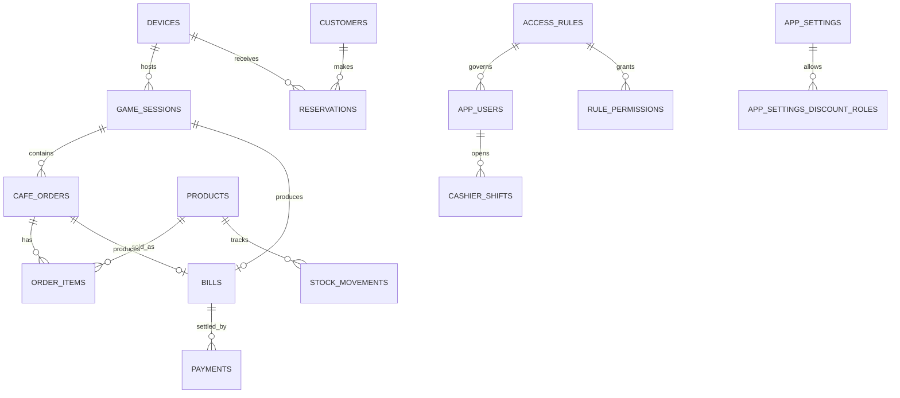

The SQLite baseline creates the application’s operational tables:

`access_rules` · `role_permissions` · `rule_permissions` · `app_users` · `devices` · `products` · `pricing` · `game_sessions` · `cafe_orders` · `order_items` · `bills` · `payments` · `cashier_shifts` · `stock_movements` · `customers` · `reservations` · `app_settings` · `app_settings_discount_roles`.

### Migration policy

- 🛫 Runtime SQLite migrations live in [`backend/src/main/resources/db/migration/sqlite`](backend/src/main/resources/db/migration/sqlite) plus the Java compatibility migration under [`backend/src/main/java/db/migration/sqlite`](backend/src/main/java/db/migration/sqlite).
- 🧱 Production disables Hibernate schema mutation with `ddl-auto=none`; Flyway owns future production schema changes.
- 🧪 Development keeps the existing non-destructive `ddl-auto=update` behavior for compatibility with a developer database.
- 🚫 Production Flyway clean/destructive actions are disabled.
- 🔒 Applied migrations are immutable. Add a new versioned migration for a schema change; do not edit an already-applied migration or repair history blindly.
- 🧳 The installed database is outside the application directory, so upgrades replace binaries without replacing customer data.

## 🔐 Security and permissions

### Defense-in-depth model

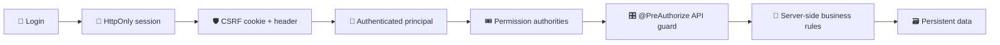

- 🔑 Passwords are verified with BCrypt; plaintext passwords are not stored.
- 🍪 Authentication uses a server-side session. Cookies are configured with HTTP-only and SameSite protections.
- 🛡️ State-changing requests use Spring Security CSRF protection; the frontend obtains the CSRF token before login and echoes it on writes.
- 🎟️ Permissions are represented as authorities such as `PERMISSION_OPERATIONS_USE` and checked at controller boundaries with `@PreAuthorize`.
- 🧭 The frontend filters navigation for usability, but the backend remains the source of truth for authorization.
- 🚫 Sensitive rules, billing validation, passwords, financial calculations, and database access remain server-side; React receives only API data.
- 🌍 Production is same-origin and does not require `localhost:5173` CORS. Development CORS is centralized and restricted to the Vite origins.
- 🔒 Do not commit `.env`. Use the root `.env.example` as a variable-name template and supply real values through the local environment or deployment process.

### Permission groups

| Group | Examples |
| --- | --- |
| 🎮 Operations | `OPERATIONS_USE`, `RESERVATIONS_MANAGE`, `SHIFT_MANAGE` |
| 💳 Sales | `POS_USE`, `CHECKOUT_USE`, `BILL_REFUND`, `DISCOUNTS_MANAGE`, `BILLING_MANAGE` |
| 📦 Catalog/inventory | `PRODUCTS_VIEW`, `PRODUCTS_MANAGE`, `PRICING_VIEW`, `PRICING_MANAGE`, `INVENTORY_VIEW`, `INVENTORY_MANAGE` |
| 📊 Reporting | `DASHBOARD_VIEW`, `REPORTS_VIEW`, `SHIFT_AUDIT` |
| 👥 Access control | `USERS_MANAGE`, `PERMISSIONS_MANAGE`, `SETTINGS_MANAGE`, `DESTRUCTIVE_OPERATIONS` |

## 📁 Repository map

```text
Gaming-Cafe-Management-System/
├── backend/
│   ├── pom.xml                                  # Maven build, dependencies, packaging
│   └── src/
│       ├── main/java/com/cafe/ps/
│       │   ├── controller/                      # REST API boundary
│       │   ├── config/                           # Security, paths, SPA, seed, errors
│       │   ├── dto/                              # Validated request/response records
│       │   ├── entity/                           # JPA entities and domain enums
│       │   ├── repository/                       # Spring Data repositories
│       │   ├── service/                          # Business logic and transactions
│       │   ├── audit/                            # Audit event model/logging
│       │   └── launcher/                         # Silent Windows launcher entry point
│       ├── main/resources/
│       │   ├── application.properties            # Shared defaults
│       │   ├── application-dev.properties        # Developer SQLite/profile settings
│       │   ├── application-prod.properties       # Installed runtime settings
│       │   ├── logback-spring.xml                # Console/file/audit logging
│       │   └── db/migration/                     # Flyway migrations
│       └── test/java/                             # Backend and opt-in MySQL tests
├── frontend/
│   ├── package.json                              # Vite scripts and React dependencies
│   ├── vite.config.js                            # Dev server and /api proxy
│   └── src/
│       ├── api/                                  # Domain API clients
│       ├── auth/                                 # Auth context and permissions
│       ├── components/                           # Pages, modals, cards, layout
│       ├── i18n.jsx                              # Language provider/translations
│       ├── App.jsx                               # Lightweight pathname routing
│       └── main.jsx                              # React entry point
├── scripts/
│   ├── build-production.bat                      # One-command release pipeline
│   ├── package-windows.bat                       # jpackage app image/installer
│   ├── db-backup.* / db-restore.*                # Maintenance helpers
│   └── ...
├── docs/assets/
│   └── gaming-cafe-runtime-flow.svg              # Local animated README visual
├── .env.example                                  # Safe variable-name template
└── README.md                                     # This guide
```

Generated or machine-local folders are intentionally excluded from source control: `.git`, `node_modules`, `target`, `dist`, `build`, `coverage`, IDE metadata, local `.env`, and SQLite runtime data.

## 💻 Development

### Build-machine prerequisites

- ☕ JDK 17 or newer with `java` and `jpackage` available.
- 🧰 Maven 3.9 or newer.
- ⚛️ Node.js 20.19+ and npm 10.8.2+ for direct frontend work. Release Maven builds provision the pinned frontend toolchain in an isolated workspace.
- 🗃️ A disposable MySQL instance only for the opt-in MySQL integration suite; the application runtime uses SQLite.

### Optional local environment

Copy `.env.example` to `.env` and fill in local values privately. The file is ignored by Git and must never be committed. No credentials are documented here.

### Start the backend

From `backend/`:

```bash
mvn spring-boot:run
```

This activates the development profile, uses `backend/ps_cafe.db`, binds to `127.0.0.1:8080`, and enables developer-oriented logging.

### Start the frontend

From `frontend/`:

```bash
npm install
npm run dev
```

Open `http://localhost:5173`. Vite proxies `/api` to `http://localhost:8080`, so frontend code uses the same relative URLs used in production.

### Frontend checks

```bash
npm test
npm run build
```

The standalone frontend bundle is written to `frontend/dist/`. It is useful for frontend verification but is not required at runtime because Maven embeds the production bundle into Spring Boot.

### Backend checks

From `backend/`:

```bash
mvn -B test
```

The default Maven test lifecycle excludes classes tagged `mysql`. Run the dedicated suite only against a disposable test database:

```bash
mvn -Pmysql-integration test
```

## 📦 Production packaging

### One-command release pipeline

From the repository root on Windows:

```bat
scripts\build-production.bat
```

The pipeline fails fast and performs this sequence:

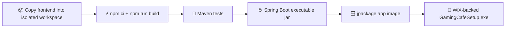

Build outputs:

| Artifact | Path |
| --- | --- |
| Frontend-only bundle | `frontend/dist/` |
| Executable Spring Boot jar | `backend/target/gaming-cafe.jar` |
| Thin jar used by jpackage | `backend/target/gaming-cafe.jar.original` |
| Bundled-Java app image | `backend/target/installer/Gaming Cafe/` |
| Windows installer | `backend/target/installer/GamingCafeSetup.exe` |

### Build without WiX

If WiX is not installed, verify the complete bundled-Java application image:

```bat
set "GAMING_CAFE_APP_IMAGE_ONLY=1"
scripts\package-windows.bat
```

The app image still contains the native launcher and bundled runtime. Only the final installer generation is skipped.

### What the client receives

The installer contains runtime artifacts only:

- ✅ Spring Boot application and dependencies
- ✅ React browser bundle
- ✅ Bundled Java runtime generated by `jpackage`
- ✅ Windows launcher, Start Menu shortcut, desktop shortcut, and uninstall registration
- 🚫 No Java installation requirement
- 🚫 No Node.js/npm/Maven/IntelliJ requirement
- 🚫 No source code, `.git`, IDE metadata, `node_modules`, or build caches

## 🪟 Client experience

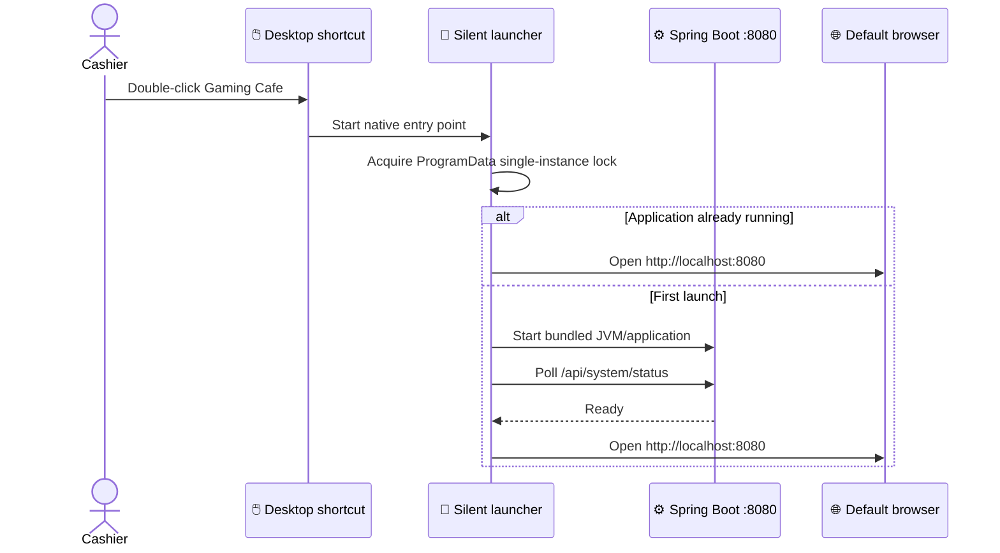

### Launcher behavior

- 🔒 Prevents multiple application instances from sharing the SQLite database.
- ⏳ Opens the browser only after the readiness endpoint responds successfully.
- 🚧 Detects an occupied port 8080 and records a useful failure instead of silently selecting a random port.
- 🔑 On a new database with no users, uses explicitly supplied admin environment values or generates a strong one-time password and displays it once after startup. It does not write that password to logs.
- 📴 Runs without a normal terminal window when launched from the packaged Windows entry point.
- 🔁 Optional start-at-login can be enabled by placing the installed shortcut in the user’s Windows Startup folder; it is not forced by the installer.

## 💾 Operations, backups, and upgrades

### Installed filesystem layout

```text
C:\Program Files\GamingCafe\
    Gaming Cafe.exe
    app\
    runtime\

C:\ProgramData\GamingCafe\
    data\
        gaming-cafe.db
    logs\
        gaming-cafe.log
        launcher.log
        audit.log
    backup\
        gaming-cafe-YYYY-MM-DD-HHmmss.db
```

`RuntimePaths` and `ApplicationPathsEnvironmentPostProcessor` resolve and create these locations centrally. The database and logs are never stored under Program Files.

### Backup foundation

Authenticated administrators can call:

```text
POST /api/system/backup
```

`DatabaseBackupService` uses SQLite’s online backup API, writes to a temporary file, validates the handoff, and atomically moves the result into the backup directory. It does not blindly copy the live database file during a write transaction.

The current foundation is local-only. Cloud backup, encryption at rest, retention policies, and automated restore drills are intentionally separate follow-up capabilities.

### Safe upgrades

1. The installer replaces application binaries under `C:\Program Files\GamingCafe`.
2. The database remains under `C:\ProgramData\GamingCafe\data`.
3. Flyway applies only reviewed, forward-only migrations.
4. Existing sessions, bills, payments, users, inventory, settings, and reports remain outside the application image.
5. Take a verified backup before installing a new release.

### Versioning

The authoritative application version is `<version>` in [`backend/pom.xml`](backend/pom.xml). Keep the frontend package version and lockfile root aligned for release metadata.

For `1.0.1`:

```text
1. Change backend/pom.xml project version to 1.0.1.
2. Update frontend/package.json and the lockfile root to 1.0.1.
3. Run scripts\build-production.bat.
4. Collect backend\target\installer\GamingCafeSetup.exe.
```

The fixed jpackage upgrade UUID lets Windows recognize later installers as upgrades, while the ProgramData data directory remains intact.

## ✅ Testing and verification

| Check | Command / evidence | Current behavior |
| --- | --- | --- |
| Frontend unit/component tests | `cd frontend && npm test` | Vitest suite; latest verified run: 9 files and 56 tests passed |
| Frontend production build | `cd frontend && npm run build` | Vite writes `frontend/dist/` successfully |
| Backend default suite | `cd backend && mvn -B test` | Passes local tests; MySQL-tagged integration tests are excluded by default |
| MySQL integration suite | `cd backend && mvn -Pmysql-integration test` | Requires disposable MySQL and `TEST_DB_*` configuration |
| Spring Boot package | `cd backend && mvn clean package` | Builds the executable jar and embeds the React bundle |
| Packaged runtime | `java -jar backend/target/gaming-cafe.jar` | Serves UI and `/api/**` on port 8080 with the production profile |
| Windows app image | `set GAMING_CAFE_APP_IMAGE_ONLY=1` + package script | Verifies native launcher and bundled JVM without WiX |
| Windows installer | `scripts\build-production.bat` | Requires WiX Toolset 3.x on the build machine |
| Runtime smoke checks | `/`, `/operations`, `/api/system/status` | Launcher waits for readiness; SPA routes are forwarded by Spring Boot |

### Health and observability endpoints

- `GET /api/system/status` — public identity/readiness endpoint used by the launcher.
- `GET /actuator/health` — public health probe with details hidden.
- `GET /actuator/info` — application metadata.
- Rolling application, launcher, and audit logs live outside Program Files under `%ProgramData%\GamingCafe\logs` in production.

## 🌐 Local network mode

The workstation can be the shop’s local host. Other authorized computers on the same network can use:

```text
http://<host-pc-name-or-ip>:8080
```

The host Windows Firewall must permit inbound TCP 8080, and the shop’s network should be trusted. No external internet connection is required after the application is installed; external services are not part of the core runtime path.

## ⚠️ Known limitations

- 🧰 The final `.exe` installer requires WiX Toolset 3.x on the build machine; app-image generation can be verified without WiX.
- 🗃️ The existing backend integration suite is MySQL-specific even though the client runtime uses SQLite; a dedicated SQLite integration matrix remains valuable.
- 🛟 Backups are a local safe-backup foundation, not yet encrypted/cloud/retention-managed disaster recovery.
- 🌐 The UI is browser-based by design. React JavaScript must be distributed to the browser; sensitive authorization, financial, persistence, and validation rules remain in Spring Boot.
- 🧪 Full business-flow QA still requires a controlled manual pass across session types, reservations, POS, checkout, refunds, shifts, permissions, and upgrade/restore scenarios.

## 🤝 Contribution guide

1. Create or switch to a focused feature branch.
2. Keep applied Flyway migrations immutable.
3. Preserve the relative `/api` contract so Vite and production remain compatible.
4. Add or update backend/frontend tests with behavior changes.
5. Run `npm test`, `npm run build`, and `mvn -B test` before opening a pull request.
6. Never commit `.env`, credentials, database files, installer caches, or generated build output.

<div align="center">

  <sub>Built for fast counters, reliable shifts, and a calm cashier experience. 🎮 ☕ 🧾</sub>

</div>
